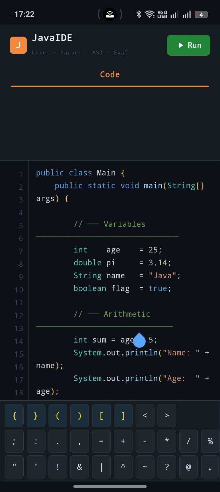
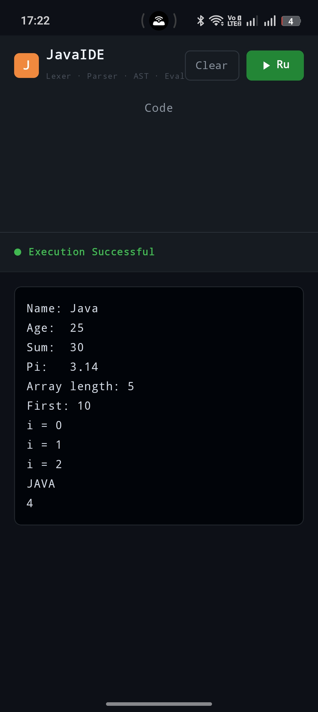

<div align="center">

<br/>

<h1>⚡ ByteForge</h1>

<p><strong>A full Java compiler &amp; IDE built from scratch on Android.</strong><br/>
<em>Lexer → Tokens → Parser → AST → Interpreter — all running on your phone.</em></p>

<br/>

[](https://developer.android.com)
[](https://kotlinlang.org)
[](https://www.java.com)
[](https://developer.android.com/jetpack/compose)
[](LICENSE)
[](https://github.com/Kingjha13/ByteForge/stargazers)

<br/>

> *Most "Java compilers" on Android just call a remote API. ByteForge doesn't.*
> *Every token is scanned, every expression is parsed, every statement is executed — locally, on-device, from scratch.*

<br/>

</div>

---

## 📸 Screenshots

<div align="center">
<table>
  <tr>
    <td align="center"><b>Code Editor</b></td>
    <td align="center"><b>Program Output</b></td>
  </tr>
  <tr>
    <td></td>
    <td></td>
  </tr>
</table>
</div>

---

## 🔍 What is ByteForge?

ByteForge is an Android application that implements a **complete Java interpreter pipeline** — built entirely from scratch in Java and Kotlin, with no external compiler libraries, no remote execution, and no shortcuts.

You write Java code in a **LeetCode-style editor** with syntax highlighting, and ByteForge processes it through the full compiler theory pipeline:

```
Source Code
      │
      ▼
┌───────────┐     ┌───────────┐     ┌───────────┐     ┌───────────────┐
│   Lexer   │────▶│  Parser   │────▶│    AST    │────▶│  Interpreter  │
│           │     │           │     │           │     │               │
│ chars     │     │ tokens    │     │ tree of   │     │ walks tree,   │
│ → tokens  │     │ → nodes   │     │ nodes     │     │ runs code     │
└───────────┘     └───────────┘     └───────────┘     └───────────────┘
```

---

## ✨ Features

### 🖥️ Editor
- **Syntax highlighting** — keywords, types, strings, numbers, brackets, comments all individually colored
- **Line numbers** — synced gutter that scrolls with your code
- **Symbol keyboard toolbar** — one-tap insert for `{ } ( ) [ ] ; : . , = + - * / % " ' ! & | ↵` and more
- **Cursor-aware insertion** — symbols land exactly where your cursor is

### ⚙️ Compiler Pipeline

| Stage | File | What it does |
|---|---|---|
| **Lexer** | `Lexer.java` | Scans characters → produces a stream of `Token` objects |
| **Token** | `Token.java` + `TokenType.java` | Typed tokens: KEYWORD, IDENTIFIER, NUMBER, OPERATOR… |
| **Parser** | `Parser.java` | Consumes tokens → builds an Abstract Syntax Tree |
| **AST** | `ASTNode.java` | Node types: expressions, statements, declarations |
| **Environment** | `Environment.java` | Variable scopes and symbol table |
| **Interpreter** | `JavaInterpreter.java` | Tree-walk interpreter that evaluates the AST |
| **Result** | `InterpreterResult.java` | Captures output lines and runtime errors |

### ✅ Supported Java Constructs

- Variable declarations — `int`, `double`, `String`, `boolean`, `char`
- Arithmetic — `+ - * / %` with proper operator precedence
- String concatenation — `"Hello " + name`
- Arrays — declaration, indexing, `.length`
- `for` loops
- `if / else` conditionals
- `System.out.println()` and `System.out.print()`
- String methods — `.toUpperCase()`, `.length()`, etc.
- Comments — `//` single-line and `/* */` multi-line

### 🎨 UI Highlights
- GitHub-dark theme (`#0D1117` base)
- LeetCode-style tab navigation — Code / Output
- Terminal-style output panel with color-coded success / error states
- Animated tab transitions

---

## 🛠️ Tech Stack

| Layer | Technology |
|---|---|
| Language | Kotlin (UI) + Java (Compiler Engine) |
| UI Framework | Jetpack Compose with Material 3 |
| Architecture | Single-Activity, Composable-first |
| Min SDK | Android 7.0 (API 24) |
| Target SDK | Android 14 (API 34) |
| Build System | Gradle with Kotlin DSL |

---

## 📁 Project Structure

```
ByteForge/
├── README.md
├── app/
│   ├── img.png                          ← Screenshot 1
│   ├── img_1.png                        ← Screenshot 2
│   └── src/main/java/com/javacompiler/
│       ├── MainActivity.kt              ← Root Activity + all Compose UI
│       ├── interpreter/
│       │   ├── Lexer.java               ← Tokenizer
│       │   ├── Token.java               ← Token model
│       │   ├── TokenType.java           ← Token type enum
│       │   ├── Parser.java              ← Recursive-descent parser
│       │   ├── ASTNode.java             ← AST node definitions
│       │   ├── Environment.java         ← Variable scope / symbol table
│       │   ├── JavaInterpreter.java     ← Tree-walk interpreter
│       │   ├── InterpreterResult.java   ← Output + error result
│       │   ├── LexerException.java      ← Lexer errors
│       │   ├── ParseException.java      ← Parse errors
│       │   └── RuntimeError.java        ← Runtime errors
│       └── ui/theme/
│           └── Theme.kt                 ← Color palette + typography
└── app/build.gradle.kts
```

---

## 🚀 Getting Started

### Prerequisites
- Android Studio Hedgehog or newer
- JDK 17+
- Android device or emulator — API 24+

### Clone & Run

```bash
git clone https://github.com/Kingjha13/ByteForge.git
cd ByteForge
```

Open in Android Studio → let Gradle sync → hit **▶ Run**.

No API keys. No internet permission. No external compiler libraries. Just open and run.

---

## 💻 Sample Code to Try

```java
public class Main {
    public static void main(String[] args) {

        // Variables
        int age     = 25;
        String name = "ByteForge";
        double pi   = 3.14;

        // Arithmetic
        int doubled = age * 2;
        System.out.println("Hello from " + name + "!");
        System.out.println("Age doubled: " + doubled);

        // Array + loop
        int[] scores = {90, 85, 92, 78, 95};
        for (int i = 0; i < scores.length; i++) {
            System.out.println("Score " + i + ": " + scores[i]);
        }

        // String methods
        System.out.println(name.toUpperCase());
        System.out.println("Length: " + name.length());
    }
}
```

---

## 🗺️ Roadmap

- [ ] `while` and `do-while` loops
- [ ] Method definitions and calls
- [ ] Object instantiation (basic classes)
- [ ] Type casting
- [ ] `switch` statements
- [ ] Code auto-indentation
- [ ] Undo / Redo in editor
- [ ] Save & load code files
- [ ] Dark / light theme toggle

---

## 🤝 Contributing

Contributions are welcome! Here's the flow:

1. Fork the repo
2. Create a branch: `git checkout -b feat/your-feature-name`
3. Commit with conventional messages
4. Push and open a Pull Request

### Commit Message Convention

```
<type>(<scope>): <short description>

Types:   feat | fix | refactor | style | docs | test | chore
Scopes:  lexer | parser | ast | interpreter | ui | editor | output | build
```

Examples:
```
feat(interpreter): add while loop support
fix(lexer): handle escape sequences in string literals
style(editor): sync line number gutter scroll with text field
refactor(parser): extract expression parsing into sub-methods
docs: add README with project structure and roadmap
```

---

## 👤 Author

<div align="center">

**King Jha**
[@Kingjha13](https://github.com/Kingjha13)

*Building compilers from scratch, one token at a time.*

<br/>

⭐ If you found this interesting, drop a star — it helps more than you think.

</div>

---

<div align="center">
<sub>Built with ❤️ using Kotlin + Jetpack Compose + raw compiler theory</sub>
</div>